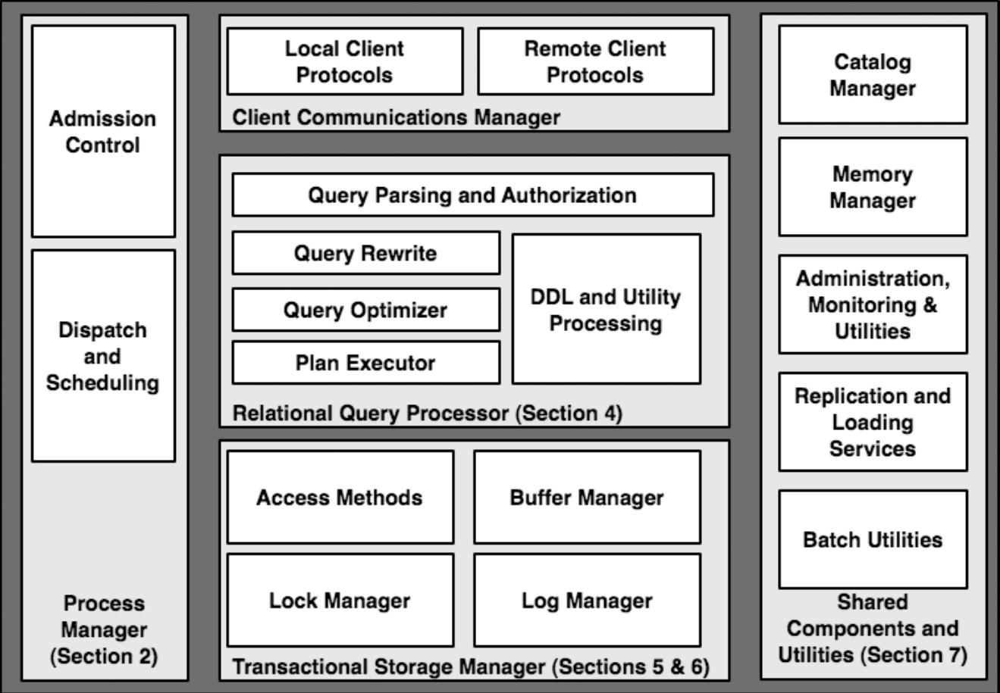
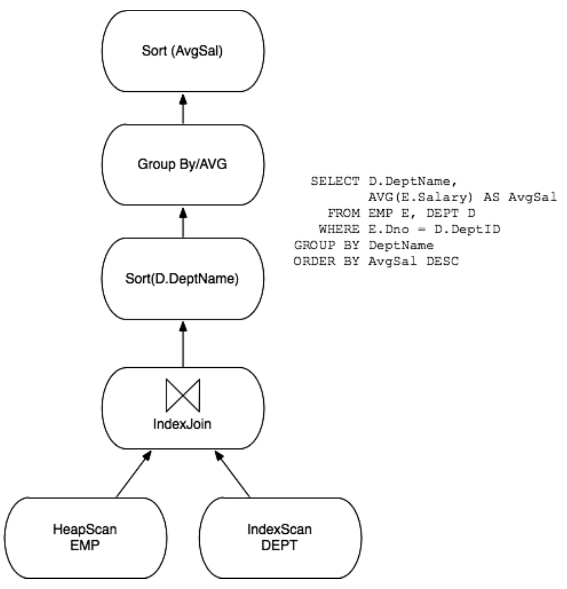
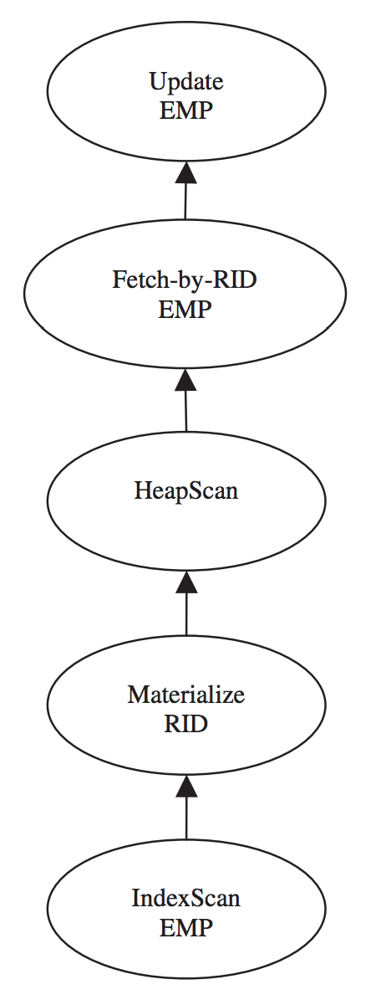

## 零. 前言

`Architecture of a Database System`是一篇2007年的经典论文，讲述了数据库架构的方方面面，部分内容在一般教材中较少涉及，整体内容讲得比较浅，如果需要对某一方面深入研读，原文中也列出了很多参考文献。




## 一. 进程模型

- #### 多进程

  一个DBMS工作线程对应一个进程，或者通过进程池复用进程。

  选择多进程的原因：早起os对线程支持不好，一个进程crash不影响其他进程。

  <br/>

- #### 多线程

  一个DBMS工作线程对应一个线程，或者通过线程池复用进程。

  <br/>

- #### 协程

  用户态线程，更轻量的上下文切换。

  需要避免同步io或者可能引起block的系统调用导致协程无法调度。

<br/>

## 二. 并行架构：进程和内存协调

- #### Shared-Memory

  多处理器共享内存的单机架构。

  <br/>

- #### Shared-Nothing

  数据分布的方式：`hash`，`range`，`round-robin`，`hybrid`。

  海量数据水平扩展，需要控制节点的负载均衡。

  `chained declustering`：节点容错，细粒度的数据冗余，相对于粗粒度的整个数据库冗余。

  处理分布式事务需要额外的协调服务。

  <br/>

- #### Shared-Disk

  优点：数据库节点crash，不影响数据库服务。

  复杂度：分布式的`lock manager`，分布式的满足`cache-coherency`的`buffer pool`。

  <br/>

- #### Numa

  `Non-Uniform Memory Access`，对于多处理器共享内存的单机架构，大的共享内存划分成一个个pod，每个处理器访问本地pod的速度更快。

  对于DBMS，用Numa模式的意思是啥呢。

  <br/>

- #### DBMS线程和多处理器

  每个cpu core一个进/线程，充分利用硬件并行度，并减小进程的内存开销。

  <br/>

- #### 数据副本的复制

  1. `Data storage level (Storage-Area Networks)`
  2. `Database storage engine level`
  3. `Redundant execution of queries by the query processor`
  4. `Redundant database requests auto-generated at the client software level`

  <br/>

- #### SQL查询的缓存层

<br/>

## 三. 关系查询处理

- #### 查询解析和授权

  验证SQL的合法性，解析from后的表名，转化为`<服务器. 数据库. 模式. 表名>`，最后编译为内部的查询结构。

  <br/>

- #### 查询重写

  1. 视图展开：查找`catalog manager`，将查询中引用的视图展开成具体的视图定义。

  2. 常量算数表达式：`R.x < 10+2+R.y `重写成 `R.x < 12+R.y`。

  3. 谓词逻辑重写：`Emp.salary < 75000 AND Emp.salary > 1000000`重写成false。

  4. 语义优化：

     比如下面这个语句，Emp表中的deptno字段对应是Dept表中dno主键的外键。所以可以直接去掉该`query predicate`。

     ```sql
     SELECT Emp.name, Emp.salary 
     FROM Emp, Dept 
     WHERE Emp.deptno = Dept.dno;
     ```

     这样的语义优化会出现在任何当`query predicate`和表自身的限制条件冲突的时候。

  5. 平坦化子查询以及基于先验知识的重写：

     目前的查询优化器都是基于独立的`SELECT-FROM-WHERE`查询块。所以会尽可能将nested查询平坦化，便于查询优化器工作。

     另外nested的查询也不利于查询的并行化执行。
     
     <br/>

- #### 查询优化

  

  1. **计划空间**：延迟笛卡尔积计算，限制查询计划空间，还提到了`left-deep`和`bushy-tree`，没太理解。

  2. **选择性估算**：join的时候需要通过分析对应列的数据分布来选择合适的join顺序，一般通过直方图`histgram`以及抽样`sampling`的方式来分析对应列的数据分布。

  3. **搜索算法**：查询树是自上而下，或者自下而上，没完全理解。

  4. **并行化**：单个查询内部的执行计划将在多个cpu或者多个物理节点上执行，文中提到一阶段和两阶段的优化器，没看懂。

  5. **自调优`Auto-Tuning`**：收集查询负载，以使用优化器确定查询的代价。具体DBMS是怎么自动优化的，以后再了解吧。

  6. **预编译SQL**：

     数据库中提供预编译SQL的功能，提前做好查询的解析，重写，优化。由于数据以及索引是动态变化的，而对于预编译SQL中的变量，优化器会选择一个典型值，当后续查询SQL中的变量是非典型值，就会产生一个糟糕的执行计划。

     即便没有直接显式预编译，DBMS还会有`query plan cache`，对于后续近似的查询使用相同的执行计划。

     执行计划一定会被重新编译的情况：比如索引删除的时候。

     执行计划可能会被重新编译：取决于DBMS是希望提供可预测的执行计划，还是每次都尽量提供最优的执行计划。
   
     <br/>
  
- #### 查询执行

  1. **Iterator模式**：整个查询计划是一个图，每个操作节点通过调用指向子节点的边的`get_next()`接口，获取下一个`tuple`的引用。整体是一个单线程执行的过程，将数据流和控制流结合在一起，不需要像生产者消费者模式那样进行限流。

     每个父节点的若干子节点可以是`file scan`， `index scan`，`sort`，`nested-loops join`，`merge-join`，

     `hash join`，`duplicate-elimination`，`grouped-aggregation`。

     Iterator模式如何并行化查询，参见下文。

     > G. Graefe, “Encapsulation of parallelism in the volcano query processing system,” in Proceedings of ACM-SIGMOD International Conference on Management of Data, pp. 102–111, Atlantic City, May 1990.

  2. **数据在哪里**：每个`iterator(edge in graph)`拥有固定数量的输入/输出的`tuple descriptor`，每个`tuple descriptor`是一个`column reference`数组，每个`column reference`指向包含内存中对应`tuple`的指针以及该`column`在`tuple`的偏移。

     **BP-tuple**：位于`buffer pool`中的`tuple`。

     **M-tuple**：位于`heap`中的`tuple`。

     `BP-tuple``可以在查询执行过程中避免内存拷贝，使用的时候需要`pin`和`unpin`，但会影响`buffer pool的缓存管理策略。所以一般的系统会同时支持`BP-tuple`和`M-tuple`。

  3. **数据修改语句**：DML语句除了只读查询，还包括写语句。

     ```sql
     UPDATE EMP 
     SET salary=salary*1.1 
     WHERE salary < 20000; 
     ```

     上面这个update语句，若直接通过`index scan`对获取到的tuple进行更新，会造成`Halloween problem`，因为更新的tuple插入索引中，会对接下来的扫描可见(`txn`的修改对于之后本`txn`的读可见)。

     为了避免重复更新同一个tuple，按照下图的执行计划，增加`materialization`操作，先获取匹配的所有`Record-ID`写入临时文件中，然后对获得的所有`Record-ID`进行tuple的更新。

     如果非要在`index scan`时立刻更新，需要`multi-version`支持。

     

     

     访问方法(`Access Method`)访问`disk-based`数据，一般通过`B+-tree`索引。另外还有`R-tree`，`KD-tree`，`bitmap`，`hash index`等方式。

     <br/>

- #### 访问方法(`Access Method`)

  1. 访问`disk-based`数据，直接扫描文件(`heaps`，即`unordered files`)，或通过`B+-tree`索引。另外还有`R-tree`，`KD-tree`，`bitmap`，`hash index`等方式。

     基本的API是`init()`和`get_next()`。

     **init**：init需要传入`SARG`(`search argument`)的原因，一方面，访问方法内部的索引需要这个参数来工作，另一方面，可以在访问方法内部进行相关tuple的过滤。如果在访问方法外部过滤，对于需要过滤的tuple，增加了多余的call/ret调用。文中还提到节省对于`pin/unpin page`或者`new/delete page`的开销，但在访问方法内部进行条件过滤，应该也要这个过程？除了cpu上的节省，还有个作用是确立了访问方法层和关系处理层的边界。

     **get_next()**：迭代获取所有满足条件的tuple，直到返回`NULL`。

     <br/>

  2. `DBMS`对于`tuple`需要`Record-ID`作为引用。

     **物理地址**：直接通过内存地址来标识，但是当`b+-tree`发生page的`merge`或者`split`或者`page`内`tuple`地址发生变化，对应的二级索引`secondary index`每次都要修改对应地址。一种解决办法是当`page`内可用空间放不下`tuple`时，通过类似链表的方式将tuple的余下内容放到另一个`page`内。

     **逻辑地址**：通过主键`primary key`来标识。通过`secondary index`查找时，需要先查到`primary key`，然后通过主键索引查找对应tuple。

  <br/>

- #### 数据仓库(`Data Warehouses`)

  数据仓库，用来分析海量的历史数据，通过`ETL(extract, transform, and load)`将`OLTP`中的数据迁移到`OLAP`中。

  1. 位图索引(`bitmap index`)

     对于类似性别这样的`column`，一共只有两个取值，使用`bitmap`存储索引比`b+-tree`节省很多空间，查找也更快速。

     文中提到缺点是难以`update`，可能是指一般会对bitmap进行压缩，压缩后便难以更新。

     <br/>

  2. `Fast Load`

     过去的数仓会在凌晨低峰期(`OLTP`会停止服务)通过`ETL`更新数据，所以需要更新的速度足够快，一般都会提供`bulk load`功能，比如`b+-tree`通过`bulk load`可以快速写入，避免多余的页分裂或合并。

     现在的`OLTP`不被允许停止服务，所以数仓都是实时的，需要解决两个问题：

     - 读写竞争，极端情况导致数仓`freeze up`。
     - 多次查询需要在相同的历史数据上，即需要提供`snapshot ioslation`。

     解决办法是不采用`update-in-place`，使用`MVCC`，更新的`tuple`需要被`timestamped`。

     <br/>

  3. `Materialized View`

     数仓中的查询经常设计多个巨大的表的`join`，经常会提供具化的视图，不同于`SQL`语法中的逻辑视图，`materialized view`是基于实际表产生的真实的数据结构，需要随着实时写入而更新。

     - 选择怎么样的视图去`materialize`，是一个数据库`auto tune`的话题。
     - `Materialized view`是实时更新还是定期重建，是一个性能和数据一致性权衡的问题。

     > `Materialized view`和检索引擎中对于出现频率高的，复杂的查询的匹配文档构建单独倒排链的方法有点类似。

     ​	   <br/>

  4. `OLAP and Ad-hoc Query Support`

     `Aggregate` 类型`Materialized view`常被称为`data cube`。

     `OLAP(On-line Analytical Processing)`为用户提供自定义`data cube`的接口。

     Data cube对于即席查询(`Ad-hoc Query`)没什么用，`Ad-hoc Query`是动态生成的不可预测的查询。

     <br/>

  5. `Snowflake Schema Query`的优化

     数仓的设计中，经常采用雪花模式(`snowflake schema`)，一个中心表，中心表有多列外键，对应其他多个其他维度表的主键。这样的层状结构会有多层。数仓会针对基于雪花模式的聚合查询做优化，如何优化？

     <br/>

  6. 列存

     数仓中使用列存，方便对于某一列的遍历，也便于压缩。

     列存的劣势是需要保证一行中多列的一致性以及读取时需要把多列拼接起来。列存也不方便更新，但对于一些存储日志的场景，都是追加操作，避免了更新操作。

  <br/>

- #### 数据库扩展性

  1. 抽象数据类型(`Abstract Data Type`)

     `DBMS`可以支持用户自定义的`Abstract Data Type`，并动态添加，而不是默认提供的有限类型的`column`。对于`Abstract Data Type`，用户编写常用的编程语言比如`Java`，`C`，然后`DBMS`提供运行时环境来运行。

     B+-tree index只支持`linear order`的条件判断，可以使用`R-tree`，`KD-tree`支持高维度的索引。

     <br/>

  2. 结构化类型和XML

     `Tuple`中的`column`可能是一个`array`集合， `nested`类型或者`XML`类型。处理方式有以下两种：

     - 作为一种ADT来处理。
     - 理解数据的关系，拆解成不同`table`的`join`关系。

     <br/>

  3. 全文检索

     `DBMS`中通过`b+-tree index`维护`word-<document_id-position>`以提供全文检索功能，性能不如专用的全文检索服务，特别是word出现在较多tuple中时，无论是空间占用还是查询效率都较差。

     有些`DBMS`会将`full-text index`存储在`DBMS`外部，这带来的最大挑战是优化器无法给出很好的执行计划。

     <br/>

  4. 查询优化器扩展性

     允许新的规则优化可以注册到查询优化器，比如对于新的ADT，会有新的规则优化。

     <br/>

  5. 远程数据源扩展

     处理远程数据源就像本地表一样，对于查询优化器是一个挑战，因为访问数据的时间不确定性增加。

  <br/>

- #### 标准实践

  目前DBMS对于查询处理的研究主要以`System R`为原型。

  1. 搜索策略，`top-down` vs `bottom-up`。
  2. 查询执行的`control-flow model`，`iterators and the exchange operator` vs `asynchronous producer/consumer schemes`。
  3. 更细粒度的，不同系统在`optimizer`, `executor`, 和`access method`等都有不同。
  4. `PostgreSQL`在查询处理方面比`MySQL`复杂，但MySQL被广泛使用，建议仔细阅读 MySQL 手册和查询处理的代码。

  <br/>

- #### 其他材料

  1. 如果想进行查询优化的研究，下文是一个不错的起点：

     > S. Chaudhuri, “An overview of query optimization in relational systems,” in Proceedings of ACM Principles of Database Systems (PODS), 1998.

  2. 如果想进行查询处理的研究，下文是一个不错的起点：

     > G. Graefe, “Query evaluation techniques for large databases,” Computing Surveys, vol. 25, pp. 73–170, 1993.

  3. 基于采样技术，牺牲准确性来提高性能。

  4. 数据挖掘方面的技术，比如聚类、分类，回归等被整合到`DBMS`。

  5. 新的分布式计算/存储框架，比如`hadoop`等和`DBMS`之间的互相借鉴。

<br/>

## 四. 存储管理

- 空间控制

  需要控制数据读写在`disk`的哪个位置。

  DBMS一般不直接操作`raw device`，理论上`DBMS`自己控制读写在disk的`position`，可以直接在物理device上连续读写，但实际性能提升很有限，并导致不同平台的兼容性能很差。

  此外直接通过`os`的`file system`申请一个巨大的文件，当在一个空的`file system`上第一次申请文件，一般情况下文件内的`position`相近，底层`raw device`的物理`position`也是相近的。实测表明如果把这个巨大文件当作`raw device`来读写，`TPC-C benchmark`下性能损失为6%。

  <br/>

- 时间控制：缓存

  需要控制数据什么时候从`disk`读写。

  DBMS一般使用`Direct IO`直接和`disk`交互并控制缓存。不使用`os`的`page cache`的原因：

  1. 正确性问题，需要先写`WAL`，再写脏页，如果完全交给`os`写，无法保证写的顺序，如果发生恢复，无法保证事务的`ACID`。

  2. `IO`性能问题，`DBMS`比`os`更清楚预读哪些页，什么时候刷脏页。

  3. `Main memory`性能问题，如果使用`page cache`，内存占用是两倍，且有多余的内存复制开销。

     文中特别解释了一个高端的`DBMS`，内存复制是瓶颈。

     一次内存复制，消耗`cpu cycle`，污染`cpu cache`。对于一个调优良好的`DBMS`，读会尽可能命中`buffer pool`，`IO`操作会被分享在多个`disk arm`中。所以内存复制是无法忽视的开销，并且`cpu cycle`遵循摩尔定律，`memory access`却在追赶摩尔定律，可见内存读写是内存复制的瓶颈。

  <br/>

- 缓存管理

  现代`DBMS`的`buffer pool`一般是动态的。

  `Frame table`：每个`frame`对应一个`disk block`，直接映射原始内容，没有任何转换，一方面节省cpu，另一方面便于管理`frame`，没有`fragmentation`或者`compaction`的问题。

  `Hash table`：`key`是`page number`，`value`包括该`page`再`frame table`的位置，在`disk`上的位置，以及一些元数据信息，元数据信息包括`dirty page`标记，`pin count`，`page replacement policy`需要的信息。

  `Page replacement policy`：常见的是`LRU`，`Clock`。如果一个请求需要扫描一个`table`的所有`page`，会严重影响`buffer pool`中`page`的缓存命中效果。可以使用`LRU-2`，或者对不同类型的page使用独立的替换策略，比如`b+-tree`的`root`节点的`page`和`heap file`的普通`page`。

  `Large buffer pool`：需要有快速的`recover`和有效的`checkpoint`机制。

  <br/>

- 标准实践

  文中提到给每个`disk`或者`logical volume`构建一个`file system`，然后新建一个大文件，然后使用`mmap` 操纵数据，分配`page`。应该不止一个文件，并且应该用`direct io`？

  <br/>

- 其他材料

  1. `SSD`的出现，性能和成本在`disk`和`RAM`之间的一个`trade-off`。原文是2007年发表的，目前这个时间节点，又出现了新的持久化内存，比如`intel`的`AEP`。
  2. 数据压缩，过去是对`disk`上的数据压缩，可以减小`disk io`的延迟，且尽可能缓存`disk`上的数据。随着`RAM`的访问速度相比`cpu`的计算速度越来越远，提出在请求执行的计算过程中才去解压缩，以让数据尽可能在`cpu cache`中。
  3. `Large-scale but sparse data storage`，`column-oriented storage`。

  <br/>

<br/>

## 五. 事务：并发控制和恢复

`Relational query processor`和`transactional storage engine`之间分层明确，两者之间有清晰的接口定义。文中列举了一些学习资料，因为原文并不阐述细节，主要介绍宏观架构以及模块之间的依赖关系。

1. `ACID`

   `Atomic`：事务要么提交，要么什么都没做。实现方法：`locking protocol`。

   `Consistency`：对应用的保证，事务提交后，数据库仍处于一个一致的状态，比如转账操作总额不变，不会插入两条相同的记录(主键唯一约束)。实现方法：查询执行时，如果事务行为违背了`SQL`的完整性限制，事务会被`abort`。

   `Isolation`：并发事务之间的可见性。实现方法：`locking protocol`。

   `Durability`：提交的事务对之后的事务可见，不受软硬件错误的影响。实现方法：`logging and recovery`。

   <br/>

2. Serializability

   串行化(`Serializability`)隔离级别，多个事务并发执行，最后执行的效果和多个事务串行执行一样。

   - `Strict two-phase locking (2PL)`：事务执行时，读数据前获取`shared lock`，写数据前获取`exclusive lock`，事务结束时释放所有`lock`。一般的`DBMS`使用`2PL`。
   - `Multi-Version Concurrency Control (MVCC)`：`MVCC`帮助我们在读的时候不需要获取`shared lock`，即读写相互不阻塞。
   - `Optimistic Concurrency Control (OCC)`：事务内维护读写的历史，`commit`前才检查冲突(冲突检查方式类似`2PL`)，如果冲突，则`rollback`。事务之间冲突小时，使用`OCC`性能更好。

   <br/>

3. Lock and Latch

   - `Lock Manager`

     `Database`中的任何`name`都可以有自己对应的`lock`，如`tuple`，`table`，`file`，`disk page`，`volume`。

     `Lock`会和`transaction`关联，`transaction`有`transacation id`唯一标识。

     `Lock`有不同的`mode`，不同`granularity`的`lock`通过`lock-mode compatibility table`来指定什么样的情况有资格获得什么样`mode`的`lock`。`Hierarchical lock`使得加锁的效率更高，具体可以参见下文。

     >  J. Gray, R. A. Lorie, G. R. Putzolu, and I. L. Traiger, “Granularity of locks and degrees of consistency in a shared data base,” in IFIP Working Conference on Modelling in Data Base Management Systems, pp. 365–394, 1976.

     <br/>

     `Lock manager`提供以下接口：

     `lock(lockname, transaction_id, mode)`，`removeTransaction(transaction_id)`，

     `unlock(lockname, transaction_id)`，`conditionallock(lockname, transaction_id, mode)`。

     <br/>

     `Lock manager`内部结构：

     `Global Lock Table`：一个`dynamic hash table`，`key`为`lock name`，`value`包括`lock mode`，`wait queue of lock request pairs (transaction_id, mode)`。

     `Transaction Table`：`key`为`transaction_id`，`value`包括`transaction`对应的`DBMS thread state`，以及`a list of pointers to all of transaction’s lock requests in the lock table`。前者便于`lock`可得后唤醒`DBMS thread`，后者用来`commit/abort`时释放所有`lock`。

     <br/>

     `Deadlock Detector`：

     主要两种思路，`detect waits-for cycles` 和`timeout detector`。

     <br/>

   - `Latch`

     `DBMS`中`latch`用来保护数据结构线程安全，一般由`os`通过硬件指令实现。比如`buffer pool`中`frame table`的每个`frame`都包含一个`latch`，保证`frame`更新的线程安全。

     性能上，`latch`耗费几十个`cpu cycle`，`lock`耗费几百个`cpu cycle`。

     使用上，`latch`的死锁需要由编程者自己避免，`lock`的死锁可以通过死锁检测避免。

     <br/>

   -  `Transaction Isolation Level`

     SQL标准中的事务隔离级别：

     1. `READ UNCOMMITTED`：事务会读到其他事务未提交的写入。
     2. `READ COMMITTED`：事务会读到其他事务提交的不同版本的写入。对应在`2PL`中，读完数据后立刻释放`read lock`。
     3. `REPEATABLE READ`：事务在相同`predicate`下，两次读取到的匹配`tuple`数量不一样(`phantom problem`)。
     4. `SERIALIZABLE`：保证串行化读写的效果。

     <br/>

     数据库厂商额外提供的事务隔离级别：

     1. `CURSOR STABILITY`：相比于`READ COMMITTED`，读完数据后不立刻释放`read lock`，而是读下一个数据时，才释放上一次的`read lock`，保证了`read– think–write` 操作不被其他事务的更新操作影响。
     2. `SNAPSHOT ISOLATION`：通过`MVCC`保证事务的读操作都在一个快照下。事务开始时获取`start-timestamp`，事务准备提交时，获取`end-timestamp`，验证是否有其他事务的`start/end-timestamp`和当前事务`overlap`且有`write conflict`。
     3. `READ CONSISTENCY`：`oracle`提供的一种`MVCC`实现。事务内每个`SQL`语句都能见到最新提交的写入，对于一条从`cursor`获取数据的SQL语句，可见的写入是打开`cursor`时已提交的。每个`tuple`的多版本实现是逻辑上的，不存储每个版本的数据，获取旧版本数据通过回放`undo`日志的方式实现。相比`SNAPSHOT ISOLATION`，`write conlict`时是先`write`的优先，而不是`SNAPSHOT ISOLATION`中的先`commit`的优先。

   <br/>

4. `Log Manager`

   `ARIES`算法，经典，复杂，细节繁多。文中还比较了其他方法相比`ARIES`的优劣，数据库专家必须熟悉这个算法或者这篇论文。

   >  C. Mohan, D. J. Haderle, B. G. Lindsay, H. Pirahesh, and P. M. Schwarz, “Aries: A transaction recovery method supporting fine-granularity locking and partial rollbacks using write-ahead logging,” ACM Transactions on Database Systems (TODS), vol. 17, pp. 94–162, 1992.

   

   - `Write-Ahead Logging(WAL) protocol`：

     1. 对`database page`的每次写操作，都需要产生`log record`，且`log record`需要在`database page`被`sync`前先`sync`。
     2. `Log record`需要按照顺序先后被`sync`。
     3. 事务的commit操作，需要先`sync commit log record`，然后才能返回事务`commit`成功。

     上述的第1条保证事务可以被`undo`操作回滚，第2，3条保证事务可以被`redo`操作保证持久化。

     <br/>

   - `DIRECT, STEAL/NOT-FORCE`：

     1. `DIRECT`：数据被原地更新。
     2. `STEAL`：`buffer pool`中`unpinned`的`frame`可以被`steal`，并被写回`disk`，即便`frame`中包含未提交的数据。
     3. `NOT-FORCE`：已`commit`的数据所在`dirty frame page`不一定需要被`force sync`到`disk`。

     使用`STEAL/NOT-FORCE`的好处是给予`buffer pool`和`disk io`极大的自由度来提高性能。坏处是需要`log manager`处理好各种情况，包括`undo` 被`steal`的`uncommited page`和`redo`没被`force`写`disk`的`commited page`。

     所以有些系统会采用`DIRECT NOT-STEAL/NOT-FORCE`和`DIRECT, STEAL/NOT-FORCE`的结合，尽可能不`sync`含有`uncommited data`的`page`，除非当前的`page`均包含`uncommited page`。

     <br/>

   - `Log Record`

     如果记录`physical operation`，占用空间会非常大。如果记录`logical operation`，`recovery`或者`abort`会很慢。所以实际应用中一般使用`physiological`，混合使用`physical logging`和`logical logging`。

     在`ARIES`中，`physical logging`用来支持`REDO`，`logical logging`用来支持`UNDO`。在`recovery`过程中，先回放历史到达`crash state`，再回滚未提交的事务。

     <br/>

   - `Check Point`

     如果每次`crash`之后都在日志中从头开始`recovery`，耗费时间太长。实际可以从`recovery log sequence number(recovery LSN)`开始，`recovery LSN`是`min`(当前活跃的最旧的事务对应的`LSN` 和 `buffer pool`中最旧的`dirty page`对应的LSN)。这两个`LSN`，前者表明至少从这个`LSN`开始才能保证全部`UNDO`，后者表明至少从这个`LSN`才能保证全部`REDO`。

     比较朴素的方法是每次checkpoint时，停止写入，sync所有buffer pool中的dirty page，然后计算并存储recovery LSN。ARIES提供了更高效的fuzzy checkpoint，recovery LSN并不需要完全准确，checkpoint时不需要同步地sync dirty page。

     <br/>

   - 其他

     事务`rollback`时也会记录操作的`log record`，如果此时`disk`空间不够，导致`rollback`都不能进行，可以通过`space reservation scheme`避免。

     `Database`中的`disk page`不仅存储`tuple`，还包括`index`，`metadata`等数据，这些数据同样需要`log manager`管理。

   <br/>

5.  Locking and Logging in Indexes

   - `Latching in B+-Tree`

     对于`b+-tree index`的访问，不需要`lock`对应的`index page`，只需要`latch`。对于`b+-tree index`的`latch`，有以下三种方式：

     1. `Conservative scheme`：最保守的一种模式，暂时没看明白怎么操作的。
     2. `Latch-coupling scheme`：从`root`开始向下`latch`，当对子节点`latch`且确定子节点不会发生`split/merge`，则释放父节点的`latch`，继续往下遍历。
     3. `Right-link scheme`：`TODO`，后续看下其他资料研究下。

     <br/>

   - `Logging for Physical Structure`

     对于`b+-tree index page split/merge`的操作，如果事务`rollback`，不需要`UNDO`，因为这种改变不影响其他事务对`tuple`的读写，`ARIES`通过`nested top actions`来处理这种不需要`UNDO`的情况。`TODO`，`nested top actions`怎么实现的。

     类似的情况还包括`extent map`的修改，`extent map`是一个在`disk`上的数据结构，维护构成文件的连续的`disk page`，当有`disk page`增加时，修改`extent map`，即使事务后来`roll back`，不做`UNDO`也几乎没有影响。

     <br/>

   - `Next-Key Locking: Physical Surrogates for Logical Properties`

     为了实现完全的`serializability`还要避免`phantom problem`，对于`Name BETWEEN ‘Bob’ AND ‘Bobby’`这样的`predictate`，由于`lock manager`是一个`hash table`结构，无法对所有`predict`包含的`key`进行`lock`，直接`lock`整个`table`，代价又太大。

     一般采用`Next-Key Locking`解决，当事务读取满足条件的`tuple`时，对`b+-tree`中读到的所有`tuple`加上`lock`。当其他事务要写入满足`Name BETWEEN ‘Bob’ AND ‘Bobby’`这个条件的`tuple`时，需要获取大于写入`key`的最小`key`对应的`lock`。有时候这会导致`lock overload`，比如原来有三个`key`，1，5，100，`predictate`是1～10，则需要lock包括100在内的所有`key`。

     文中特别提到这种用物理对象(`currently-stored tuple`)替代逻辑概念(`predicate`)的思想适合运用在其他复杂的系统设计中。

   <br/>

6. `Interdependencies of Transactional Storage`

    此节主要讲述了数据库中`concurrency control, recovery management, access method`三者非常耦合，使得事务执行过程中实现的复杂度很高。

   比如对于`concurrency control`和`recovery management`，`non-strict two-phase locking`的并发控制实现，在事务`rollback`之前就可能释放了`lock`，导致`UNDO`操作难以进行。

   还举了些其他耦合的例子，暂时无法理解，后续再看吧。

   因为上述三者的复杂设计，buffer pool得到了充分的自由度，可以自由调度`io`(`NOT FORCED`)以及安排缓存策略(`STEAL`)。

   <br/>

7. 标准实践

   `PostgreSQL`通过`GIST`提供了多维度，高并发的索引。

   `MySQL`提供`InnoDB`和`MyISAM`两种存储引擎支持。

   <br/>

8. 其他材料

   - 内存越来越便宜，尽可能将热数据放入内存，要求恢复速度要尽可能快。
   - 模块化`ARIES`的日志和恢复理论以使得它能够被更广泛地使用。

<br/>

## 六. 共享组件

下面是一些几乎出现在所有数据库中的共享组件，但很少在教材或者论文中被提到。

1.  `Catalog Manager`

   目录管理器(`Catalog Manager`)，存放数据库的`metadata`，包括`user`，`schema`，`table`，`column`，`index`等。

   `Metadata`的格式和表数据一样，这样可以复用同样的代码和解析工具。

   <br/>

2. `Memory Allocator`

   除了`disk page`，在查询执行中的`hash join`，`sort`等也需要消耗大量内存，一般通过`memory context`的方式管理。

   动态分配内存`Allocator`由若干`memory context`组成，一个`memory context`是某一种用途的内存上下文，由若干`region`组成，每个`region`是一段连续的虚拟内存，包含`context label`。

   使用`memory context`的好处：

   - 空间上把相同逻辑用途的内存存放在一起，时间上可以延迟批量`malloc/free`。
   - 根据不同用途对内存需求的不同，按需申请更大或更小的`region`，比如`query optimizer`对内存需求小，但`hash join`对内存需求大。
   - 提高性能，`query parser`或者`query optimizer`需要新建大量小对象，频繁调用`malloc/free`影响性能，使用`memory context`降低调用频率。
   - 降低内存泄漏风险，分阶段的进行内存管理，比如`query optimizer`构建一个`optimizer memory context`，用完之后统一释放，然后到`query executor`阶段再构建一个`executor memory context`，用完之后再统一释放。
   - 如果使用类似jvm的`garbage collector`，无法控制`gc`时机，造成`STW`过长。
   - 便于debug。

   `DB2`让`DBA`设置`query operator`可以使用的内存上限，`DBA`需要丰富经验配置`query operator`和`buffer pool`的内存使用比例。

   `MS SQL Server`自动管理内存，`query operator`的内存也从`buffer pool`申请，除非是大于`page size`的连续内存申请。

   <br/>

3. `Disk Management Subsystem`

   `Disk Management Subsystem`管理`table`以及其他存储单元和`raw device`，`logical volume`，`file`之间的映射。

   由于早期文件系统无法支持打开过多`file descriptor`，或者单一文件大小上限仅为2 `GB`，所以`Disk Management Subsystem`需要维护`table`和`file`之间一对多或多对一的关系。

   `RAID`是面向`bytestream-oriented`的系统，对于数据库这样 `page-oriented`的系统，性能会低于预期。

   `RAID level 5`的写入性能较差，很多用户会配置使用`RAID level 1`。

   <br/>

4. `Replication Service`

   数据库的复制，可以容灾，提供多读服务。除了使用`EMC`，`SRDF`等硬件技术，还包括以下三种方法：

   - `Physical Replication`：定期全量物理复制，对于大容量的数据库显然不合适。
   - Trigger-Based Replication：通过触发器，每次对数据库的修改同时添加到一个特别的`replication table`，`replication table`的数据会被发送到远端，然后回放。提供了增量复制的功能，但对每次写入操作的`overload`太大。
   - `Log-Based Replication`：一个`log sniffer process`会读取`log`的写入，再分发给远端。有两种方式，一种是读取`log`后构建`SQL`语句，然后回放给远端；另一种是直接把`log record`发送给远端，远端一直通过`recovery`模式进行恢复。一般的数据库同时实现这两种方式，SQL Server 把第一种称为`Log Shipping`，第二种称为`Database Mirroring`。

   <br/>

5.  `Administration, Monitoring, and Utility`

   数据库的一些管理，监控等操作，不能影响在线事务请求。

   - `Optimizer Statistics Gathering`：比如`Optimizer`在统计`histogram`时不能消耗过多内存。
   - `Physical Reorganization and Index Construction`：随着事务的修改操作越来越多，后台需要对`index`或者`page`进行重组，不能影响在线事务的进行。
   - `Backup/Export`：备份或者导出数据库时，是一个长时间运行的过程，需要考虑`lock`不能过多以及保证`consistency`。
   - `Bulk Load`：批量导入数据时，提供专用的接口，提高效率，比如`b+-tree`如果多个`key`批量构建，提前避免`page split/merge`，效率更高。
   - `Monitoring, Tuning, and Resource Governer`：向`DBA`提供`SQL`接口，查询当前数据库`memory`，`lock`，`temporary storage`的使用情况，可以对占用过多资源的查询进行告警，甚至阻止该查询。

<br/>

## 七. 结论

数据库的发展来自学术研究和工业级数据库的开发经验。数据库的很多经验也被用在软件开发的其他领域。

<br/>


