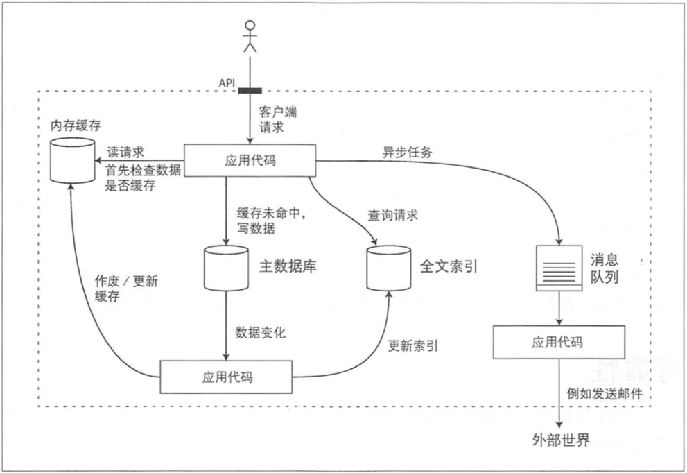

## 零. 前言

## 一. 可靠，扩展，可维护的系统

data-intensive

compute-intensive

### 可靠性 (Reliability)

硬件故障：

有研究证明硬盘的平均无故障时间( MTTF)约为 10~ 50年。因此，在一个包括 10 000个磁盘的存储集群中，我们应该预期平均每天有一个磁盘发生故障。

为硬件添加冗余来减少系统故障 率。 例如对磁盘配置 RAID，服务器配备双电源，甚至热插拔CPU， 数据中心添加备用电惊、发电机等。 当一个组件发生故障，元余组件可以快速接管，之后再更换失效的组件。

软件故障

人为故障

### 可扩展性 (Scalability)

twitter的案例

即使所有请求都相同，也会由于其他变量因素而引入一些随机延迟抖动，这些因素包括上下文切换和进程调度、网络数据包丢失和TCP重传、垃圾回收暂停、缺页中断和磁盘I/O，甚至服务器机架的机械振动。

p50，p95， p99，p999。

### 可维护性 (Maintainability)

可运维性:运维更轻松

监控，文档，自动化

简单性:简化复杂度

抽象

可演化性:易于改变

## 二. 数据模型与查询语言

1. 应用开发人员通过数据结构以及操作数据结构的api来对现实世界的‘购物车‘，’订单‘等建模。

2. 可以采用通用数据模型(例如JSON或XML文档、 关系数据库 中的表或图模型)来传输存储这些数据结构。

3. 数据库工程师接着决定用何种内存、磁盘或网络的 字 节格式来表示上述 JSON/ XML/关系/图形数据。数据表示需要支持多种方式的查询、搜索、操作和处理数据。

4. 在更下一层，硬件工程师则需要考虑用电流、光脉冲、磁场等来表示字节。

### 关系模型与文档模型

SQL，NoSQL。

对象-关系不匹配：虽然有ORM框架。

对于一个'简历'，属于一对多关系，自包含的文档，json模型可能比关系模式模型更好。

多对一与多对多的关系

关系数据库：擅长join，多对一与多对多的关系。

文档数据库：局部性带来更好的性能。如果需要join操作，或者多对一，多对多关系，如果由应用层实现，将导致代码复杂，性能不佳。

文档模型中的模式灵活性：

读时模式，写的时候不校验，读的时候解释包含什么字段。

如果文档数据库需要修改字段定义，几乎没有开销。

写时模式：写的时候校验，确保写入的数据符合定义。关系数据库是写时模式。

如果关系数据库需要修改列(字段)定义，ddl的开销取决于具体的实现方式。

查询的数据局部性：

文档通常存储编码方式为json，xml或者二进制变体，比如MongoDB的BSON。

如果需要访问文档内的大部分字段，局部性优势体现在比关系数据库更少的IO，关系数据库需要多次索引查找不同表的不同字段。由于读取时一般会得到整个文档内容，所以一般建议文档数据库的文档不要太大，且每次读取较多字段的内容。

文档更新，如果文档大小改变，便无法原地更新，需要重写整个文档。

一些关系数据库，比如spanner，orcale，也支持类似的模式，将某些表的行内嵌在父表内。

文挡数据库与关系数据库的融合：

除了MySQL外，大部分关系数据库支持XML，包括对XML的本地修改，XML文档中进行索引和查询。

PostgreSQL，MySQL，DB2均支持JSON。

文档数据库中，RethinkDB支持join操作，而MongoDB需要在客户端进行join，性能会有影响。

两种数据模型的融合是未来发展的一条路径。

### 数据查询语言

SQL，声明式，屏蔽细节，更利于查询优化。

IMS，CODASYL，命令式，类似编程语言，手动遍历记录，判断条件是否满足，然后返回。

MapReduce查询

介于声明执和命令式之间，需要用户提供map函数和reduce函数，一般运行在分布式集群上。

SQL的分布式实现可以基于MapReduce，也可以基于其他底层模型。

### 图状数据模型

顶点(实体)，边(关系)。

属性图：

顶点 = 唯一的标识符 + 出边的集合 + 入边的集合 + 属性的集合(k-v pair)

边 = 唯一的标识符 + 边开始的顶点 + 边结束的顶点 + 描述两个顶点间关系类型的标签 + 属性的集合(k-v pair)

Cypher查询语言：

最早为 Neo4j图形数据库而创建。

SQL中的图查询：

关系数据库通过两张表分别存储顶点和边，并通过SQL查询，可以模拟图查询的效果，但比较麻烦。

比如查询居住在中国的人，有些人直接有边指向中国，有些人的边先指向北京，再指向杭州。这样便无法预先明确知道查询的条件，Cypher可以用: WITHIN\*O..非常简洁地表达这个情况:它表示“沿着一个WITHIN边，遍历零次或多次”，就像正则表达式中的*运算符(表示匹配零次或多次)那样。在SQL查询过程中这种可变的遍历路径可以使用称为递归公用表表达式(即 WITH RECURSIVE语法)来表示。

三元存储与SPARQL：

三元存储，和属性图类似。所有信息都通过主体 + 谓语 + 客体表示。

主体是一个顶点，谓语和客体分两种情况：

1. 谓语+客体 = 边 + 顶点。
2. 谓语+客体 = 顶点的属性(key + value)。

SPARQL查询语言，略。

Datalog查询语言，略。

文档数据库的目标用例是数据来自于自包含文挡，且一个文档与其他文档之间的关联很少。

图数据库则针对相反的场景，目标用例是所有数据都可能会互相关联。

## 三. 数据存储与检索

### 数据结构

#### Bitcask

Bitcask是Riak 中的默认存储引擎。

Hash table维护key-value在文件的偏移，由于hash table完全放在内存中，key的数量不能太多。

一般会把文件分段，每个段有单独的hash table和数据文件，便于后台线程对段文件进行compact，消除重复的key或者被删除的key，压缩或者合并段文件。

删除key需要加入tombstone，标记删除。

文件格式，一般是二进制。

崩溃恢复，每个段的hash table一般会持久化存储在disk上，便于快速恢复。

部分写入的记录，追加写文件的时候，随时可能崩溃，文件包含checksum，可以发现corrupt的部分，并丢弃。

并发控制，由于写入以严格的先后顺序追加到日志中，通常的实现选择是只有一个写线程。数据文件段是追加的， 并且是不可变的， 所以他们可以被 多个线程同时读取。

为什么选择追加写，不选择原地更新：

1. 顺序写在机械硬盘和固态硬盘上都比随机写快。

2. 并发控制简单很多，因为追加写后不可变。

   崩溃恢复简单很多，不必担心在重写值时发生崩愤的情况，留下一个包含部分旧值和部分新值混杂在一起的文件，这里我理解应该是不需要考虑数据库中NOT-FORCED和STOLEN的情况。

3. 合并旧段可以避免随着时间的推移数据文件出现碎片化的问题 。

hash table索引的局限性：

1. 内存可能放不下所有key，如果是一个文件hash table，读写需要大量随机IO，并且扩容或者处理哈希冲突也比较麻烦。
2. 区间查询效率低，只能遍历每个key。

#### SSTable 和 LSM-Tree

